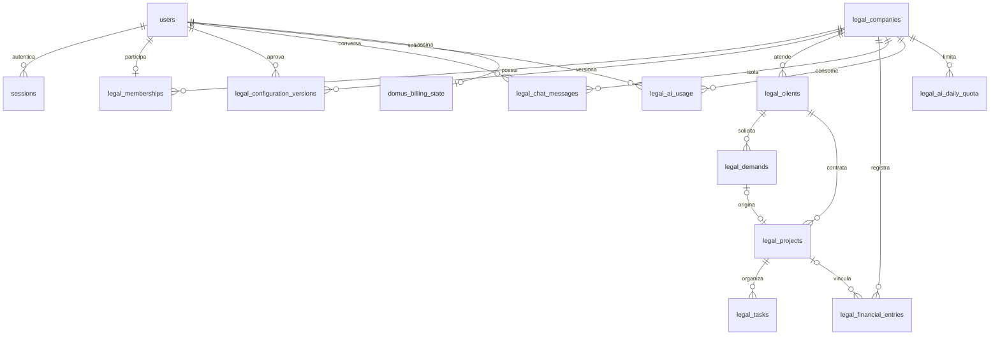

# Modelo de dados — Domus acadêmico / advocacia

## Leitura do modelo

O escritório é a fronteira de dados. A conta Google identifica uma pessoa; sua associação determina qual escritório ela pode acessar. “Caso” é o nome na interface da entidade técnica `legal_projects` (um serviço jurídico, não necessariamente um processo judicial).

As tabelas de demandas, casos e tarefas também carregam `company_id`, mesmo quando a relação acima já passa por cliente/caso. Isso permite filtrar diretamente pelo escritório e construir chaves estrangeiras que impedem vínculos entre escritórios.

## Entidades, atributos e chaves

| Tabela | Chave primária | Principais atributos e relações |
|---|---|---|
| `users` | `id` | `google_id` e `email` únicos; nome, imagem, plano Free/Pro, IDs Stripe. |
| `sessions` | `token` | `user_id` → usuário, validade. Cookie do navegador é assinado, HttpOnly, Secure em produção. |
| `legal_companies` | `id` (UUID) | Nome, configuração atual, número da versão, entrevista, proposta, revisão de edição, criação. |
| `legal_memberships` | `user_id` | `company_id` → escritório; papel. Uma conta participa de um escritório neste MVP. Convites não estão disponíveis. |
| `legal_configuration_versions` | `(company_id, version)` | Configuração aprovada, `approved_by` → usuário, data de criação. |
| `legal_clients` | `(company_id, id)` | Nome e e-mail; nome único dentro do escritório no recorte atual. |
| `legal_demands` | `(company_id, id)` | Cliente, status e dados validados: título, prioridade, responsável, prazo, valor estimado, descrição e campos personalizados. |
| `legal_projects` | `(company_id, id)` | Cliente, demanda de origem opcional e única no escritório, nome do caso, etapa, orçamento, responsável, datas e campos personalizados. |
| `legal_tasks` | `(company_id, project_id, id)` | Caso obrigatório; título, responsável, conclusão e data opcional. |
| `legal_financial_entries` | `(company_id, id)` | Caso opcional, valor decimal positivo, receber/pagar, situação; descrição, vencimento, data de baixa e categoria. |
| `legal_chat_messages` | `id` | Escritório, usuário, papel user/assistant, conteúdo, criação. Histórico separado por escritório e usuário. |
| `legal_ai_usage` | `id` | Escritório, usuário, finalidade (entrevista/chat), `response_id` único, modelo, tokens de entrada/saída/total e data. |
| `legal_ai_daily_quota` | `(company_id, day)` | Tentativas de IA reservadas atomicamente para aquele dia UTC. Não é o contador de tokens. |
| `domus_billing_state` | `user_id` | Último checkout, status da assinatura, cancelamento no fim do período, atualização. IDs de cliente/assinatura ficam em `users`. |
| `domus_billing_events` | `event_id` | Tipo e processamento do evento Stripe, para não reaplicar eventos duplicados. É recibo técnico de integração, não dado de negócio. |
| `domus_migrations` | `name` | Checksum e aplicação de cada migração. Impede alterar silenciosamente uma migração já aplicada. |

## Cardinalidades e decisões

1. Um escritório pode ter vários clientes; cada registro de cliente pertence a exatamente um escritório. Um cliente pode ter várias demandas e casos.
2. Uma demanda pode ainda não ter caso ou originar um único caso. Um caso pode ser criado diretamente ou ter uma demanda de origem. Aprovação e conversão são validadas no servidor, e a gravação ocorre em transação.
3. Um caso tem zero ou mais tarefas e lançamentos financeiros. Despesas gerais podem ser registradas sem caso.
4. A relação `(company_id, client_id)` referencia o cliente dentro do mesmo escritório. A mesma proteção vale para demanda/caso/tarefa/financeiro. O servidor nunca usa um `company_id` arbitrário enviado pelo navegador como autorização.
5. A revisão numérica do escritório detecta edições simultâneas: uma tela desatualizada recebe conflito em vez de sobrescrever dados novos silenciosamente.
6. Campos variáveis e partes descritivas ficam em JSON validado. As entidades continuam separadas, com chaves estrangeiras e restrições. Isso evita gerar tabelas ou SQL livre a partir de uma resposta de IA.
7. Valores financeiros têm coluna `numeric(14,2)` e validação para duas casas decimais. Recebimento e pagamento são situações distintas. O progresso do caso deriva das tarefas e o custo realizado deriva dos pagamentos vinculados.
8. A assinatura é ligada ao usuário proprietário no MVP de um escritório por conta. Se forem introduzidos convites, a titularidade e as permissões precisam evoluir antes de vender planos de equipe.
9. Configurações aprovadas são versionadas. Alterações incompatíveis com registros existentes devem ser recusadas; não se apagam campos já usados silenciosamente.
10. Tabelas antigas de demonstração são preservadas, mas suas rotas genéricas não são mais expostas. Não há migração automática dos dados fictícios de arquitetura para um escritório real.

## O que este DER não significa

Ter uma coluna de papel não significa que convites, gestão de equipe e todos os níveis de acesso estão implementados. Ter isolamento na API e nas chaves não significa que foi implementada uma política RLS do PostgreSQL. O navegador não acessa o banco diretamente. O schema executável está em `lib/db/migrations/`; este documento deve acompanhar mudanças nele.
